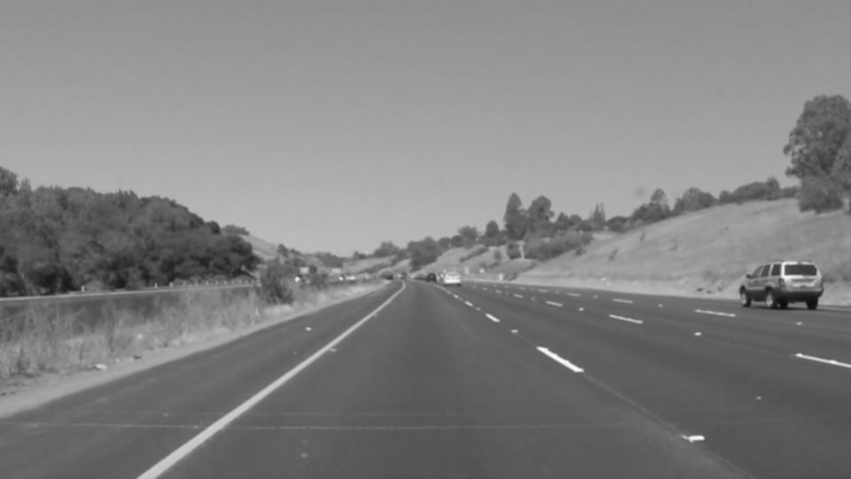
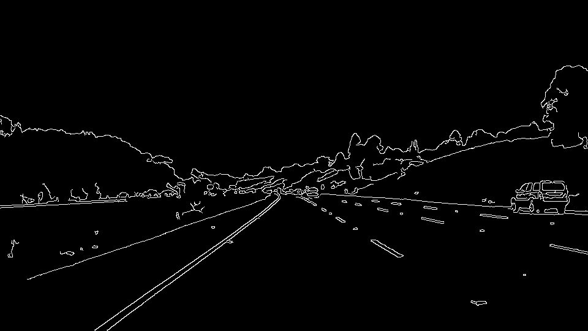
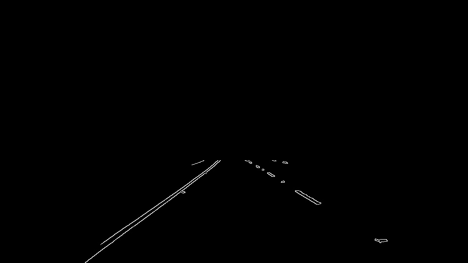
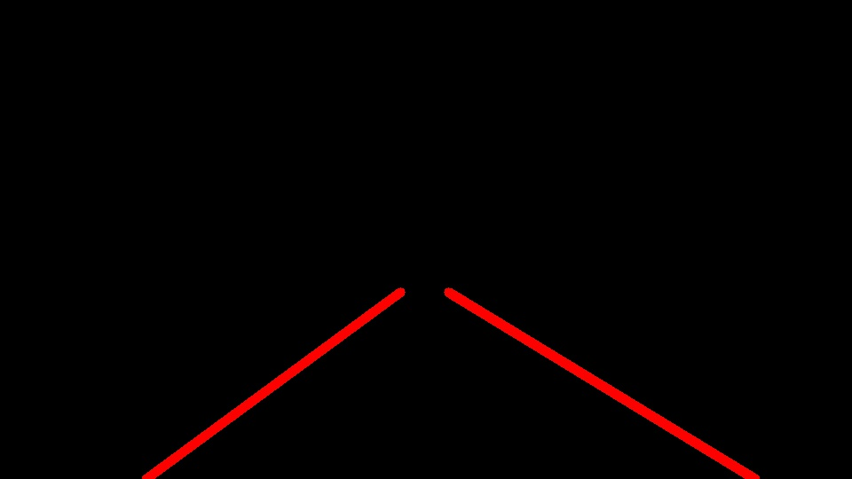
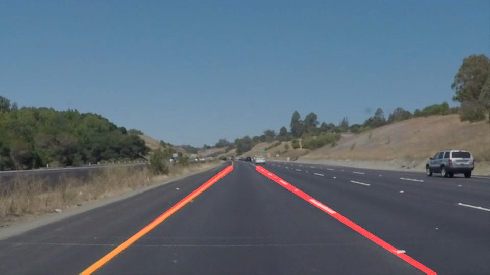
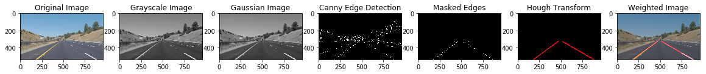

# **Finding Lane Lines on the Road**

---

**Finding Lane Lines on the Road**

The goals / steps of this project are the following:
* Make a pipeline that finds lane lines on the road
* Reflect on your work in a written report

### Reflection

My pipeline consisted of 5 steps.

1. Convert the given image to grayscale.

2. Use Gaussian blur to smoothen the image.

3. Use canny detection to identify edges.

4. Select the region of interest from the image

5. Perform Hough Transform to detect lines in the image

6. Combine these lines to original image to detect lane lines

Preview of all 6 images:

Pipeline worked fairly well on the first two videos.  
Video 1

Video 2

Video 3: Challenge Video (This video is not completely perfect, but did fairly well except for areas where there is little contrast between the lane lines and the road):

In order to draw a single line on the left and right lanes, I modified the draw_lines() function by applying following logic and modifying the algorithm.
1. Calculate slope and intercept for each line
2. If slope < 0; it is a negative slope. Append slope to neg_slope and intercept(b) to neg_intercept.
3. If slope > 0; it has a positive slope. Append slope to pos_slope and intercept(b) to pos_intercept.
4. Calculate average of neg_slope, pos_slope, neg_intercept, pos_intercept
5. Use the parameters to line equation to get values for line start and end points and finally draw the line.

If you'd like to include images to show how the pipeline works, here is how to include an image:

### 2. Identify potential shortcomings with your current pipeline

One potential shortcoming would be when there is little contrast between the lane lines and road surface. This issue was observed in the challenge video wherein for a short span the lane detection went jittery.

Another potential shortcoming could be when the road conditions are not smooth. Currently, the pipeline works good on the first two videos, and apart from the issue happening during brightness with the challenge video, the pipeline works fairly well.

### 3. Suggest possible improvements to your pipeline

A possible improvement would be to change the parameters for better fit in a generic sense.

Another improvement could be to make use of information from previous frames of the video while processing.

### References:
[Udacity- Self Driving Car Nanodegree](https://in.udacity.com/course/self-driving-car-engineer-nanodegree--nd013)

[OpenCV Tutorials](https://docs.opencv.org/2.4/doc/tutorials/tutorials.html)
